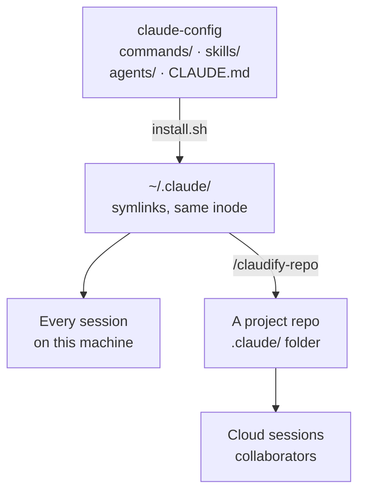

# claude-config

**Dotfiles for Claude Code** — my personal, version-controlled setup: the slash commands, skills, subagents, global instructions, and statusline I've authored.

[](https://docs.claude.com/en/docs/claude-code)
[](docs/command-skill-reference.md#global-commands)
[](docs/command-skill-reference.md#global-skills)
[](docs/command-skill-reference.md#custom-subagents)
[](https://github.com/ksdisch/claude-config/commits/main)

The canonical source lives here; [`~/.claude/`](install.sh) symlinks to it, so editing in
either place is the same file and any new command/skill/agent I create lands in git
automatically. This is also the **upstream** that my
[`/claudify-repo`](commands/claudify-repo.md) flow vendors copies of into individual
project repos.

## What's in here

| Area | Count | Browse |
|---|---|---|
| [`commands/`](commands/) |  | [Command index →](docs/command-skill-reference.md#global-commands) |
| [`skills/`](skills/) |  | [Skill index →](docs/command-skill-reference.md#global-skills) |
| [`agents/`](agents/) |  | [Subagent index →](docs/command-skill-reference.md#custom-subagents) |

**[→ Full catalog: every command, skill, and subagent](docs/command-skill-reference.md)** —
each entry links straight to its source file.

**[→ Usage playbook: how to run each one](docs/usage-playbook.md)** — the judgment companion
to the catalog: suggested model + effort, when to reach for it, and what it pairs with.

## Start here

Eight files that show what this setup actually *does*. Rows 3 and 4 are a matched pair — a
skill and the subagent it dispatches — which is the clearest look at how the pieces fit.

| | What it is |
|---|---|
| [`CLAUDE.md`](CLAUDE.md) | Instructions loaded into literally every session |
| [`operating-constraints.md`](operating-constraints.md) | Scope, honesty, and act-vs-assess guardrails |
| [`adversarial-review`](skills/adversarial-review/SKILL.md) | Author, reviewer, and judge argue before a merge |
| [`adversarial-reviewer`](agents/adversarial-reviewer.md) | The zero-context subagent that review loop dispatches |
| [`/autonomous-milestone`](commands/autonomous-milestone.md) | Plan, build, test, verify, report — unattended |
| [`kickoff`](skills/kickoff/SKILL.md) | Half-baked idea → interviewed → scaffolded repo |
| [`/handoff`](commands/handoff.md) | Portable prompt to continue in a fresh session |
| [`/claudify-repo`](commands/claudify-repo.md) | Vendors these into any other repo |

## How it works

Two distribution paths out of one canonical source — symlinked onto this machine, copied
into other repos.



- **Symlinked, not copied.** `~/.claude/commands/tdd.md` and `commands/tdd.md` are the same
  inode. Edit either one; commit from here.
- **Whole directories are linked**, so a new skill goes live on `git pull` with no
  re-install.
- **Vendored copies can drift.** `/claudify-repo` *copies* into a project's `.claude/` so
  the tooling works in cloud sessions and for collaborators — those copies don't track
  upstream.

## Install on a new machine

```bash
git clone https://github.com/ksdisch/claude-config.git ~/Projects/claude-config
~/Projects/claude-config/install.sh
```

[`install.sh`](install.sh) symlinks each item into `~/.claude/`. It's idempotent, and backs
up any pre-existing real files to `*.pre-claude-config.<timestamp>` before linking.

- It must be a **git clone** — the link set comes from `git ls-tree`, so a downloaded zip
  has nothing to link and the script exits with an error.
- It **warns loudly if you run it from a non-`main` branch**, since `~/.claude` would then
  reflect unmerged work.
- Run it before [`/claudify-repo`](commands/claudify-repo.md) — that command vendors *out
  of* `~/.claude/`, so it finds nothing until the symlinks exist.
- It also points this clone's `core.hooksPath` at [`.githooks/`](.githooks/), which activates
  the [`pre-push`](.githooks/pre-push) sync check. Until you run it, the check exists in the
  clone but nothing calls it.

## Repo layout

| Path | What | Linked into `~/.claude/`? |
|---|---|---|
| [`commands/`](commands/) | Global slash commands — [`/tdd`](commands/tdd.md), [`/begin`](commands/begin.md), [`/wrap`](commands/wrap.md), [`/brainstorm`](commands/brainstorm.md), … | ✅ |
| [`skills/`](skills/) | Global skills — [`kickoff`](skills/kickoff/SKILL.md), [`bug-hunt`](skills/bug-hunt/SKILL.md), [`ship-and-route`](skills/ship-and-route/SKILL.md), … | ✅ |
| [`agents/`](agents/) | Global subagents — [`adversarial-reviewer`](agents/adversarial-reviewer.md), [`review-judge`](agents/review-judge.md), [`silent-failure-hunter`](agents/silent-failure-hunter.md), [`spec-miner`](agents/spec-miner.md) | ✅ |
| [`CLAUDE.md`](CLAUDE.md) | Global instructions loaded into every session | ✅ |
| [`operating-constraints.md`](operating-constraints.md) | Standing behavioral constraints, referenced by `CLAUDE.md` | ✅ |
| [`statusline-command.sh`](statusline-command.sh) | Custom statusline — model, effort, context %, cost, rate limits | ✅ |
| [`install.sh`](install.sh) | The symlink installer | ❌ `DENY` |
| [`scripts/`](scripts/) | Repo-maintenance checks — [`check-doc-sync.py`](scripts/check-doc-sync.py) verifies the index ⇄ playbook stay 1:1 | ❌ `DENY` |
| [`.githooks/`](.githooks/) | Tracked git hooks — [`pre-push`](.githooks/pre-push) runs the sync check; activated by `install.sh` via `core.hooksPath` | ❌ `DENY` |
| [`docs/`](docs/) | [Command & skill reference](docs/command-skill-reference.md), [usage playbook](docs/usage-playbook.md), [design specs](docs/superpowers/specs/), [idea docs](docs/ideas/), [project guide](docs/project-guide/) | ❌ `DENY` |
| [`BACKLOG.md`](BACKLOG.md) | Open improvements and explorations | ❌ `DENY` |

## Conventions

Every item is a markdown file whose YAML frontmatter is the contract Claude reads.

| Kind | Lives at | Frontmatter keys | How it fires |
|---|---|---|---|
| **Command** | `commands/<name>.md` | `description`, `argument-hint`, `allowed-tools` | You type `/<name>`; `$ARGUMENTS` interpolates into the body. The **filename** is the command name |
| **Skill** | `skills/<name>/SKILL.md` (+ optional `references/`, `scripts/`) | `name`, `description` | Claude auto-invokes when the `description` matches the context — or you type `/<name>` |
| **Subagent** | `agents/<name>.md` | `name`, `description`, `tools`, `model` | Explicit dispatch only — from a skill that names it, or on request. Never auto-delegated |

A skill's `description` is not documentation — it's the *only* thing matched against to
decide whether to invoke. Write it as trigger conditions, including the negative ones
("NOT for: …").

```yaml
# commands/<name>.md
---
description: One sentence — what it does, in the imperative.
argument-hint: <what to pass, or [optional]>
allowed-tools: Bash, Read, Edit, Write, Glob, Grep
---

# skills/<name>/SKILL.md
---
name: <name>
description: What it does + when to use it + when NOT to use it.
---

# agents/<name>.md
---
name: <name>
description: What it does. Do NOT auto-delegate or launch proactively.
tools: Read, Grep, Glob, Bash
model: opus
---
```

**Three rules when adding, renaming, or deleting anything:**

1. **Update [`docs/command-skill-reference.md`](docs/command-skill-reference.md) *and* its
   [`docs/usage-playbook.md`](docs/usage-playbook.md) card in the same commit.** The index
   records that an item exists; the playbook says how to run it. The rule lives in
   [`CLAUDE.md`](CLAUDE.md), and [`scripts/check-doc-sync.py`](scripts/check-doc-sync.py) —
   run by the tracked [`pre-push` hook](.githooks/pre-push) — blocks a push whose rows and
   cards don't line up. It fires only when an item's *existence, name, or description*
   changes; reworking a file's internals needs no doc edit.
2. **A new top-level file or directory gets symlinked into `~/.claude/` unless you add it to
   `DENY` in [`install.sh`](install.sh).** Repo-meta and docs belong in `DENY`; content
   Claude should load does not. New files *inside* `commands/`, `skills/`, or `agents/` need
   nothing — those directories are linked wholesale.
3. **`install.sh` sources its list from `git ls-tree`, never `ls`.** Untracked and
   gitignored files can never be linked into `~/.claude/` — the guardrail that keeps secrets
   and machine-local state out. It also means `git add` is what makes a new item live.

Branch + PR for every change, and run [`adversarial-review`](skills/adversarial-review/SKILL.md)
before merging — the same rule this repo ships everywhere else.

## What's intentionally NOT here

Everything machine-specific or sensitive stays out of git (see [`.gitignore`](.gitignore)):
`settings.local.json`, `.mcp.json`, `history.jsonl`, `projects/` (which holds the
auto-managed **memory** files + project history + image cache), `sessions/`,
`shell-snapshots/`, caches, the daemon, and telemetry. Secrets never belong here.

## Editing

Just edit the files in this repo (or via the `~/.claude/` symlinks — same inode), then
commit. Changes take effect immediately in Claude Code.
